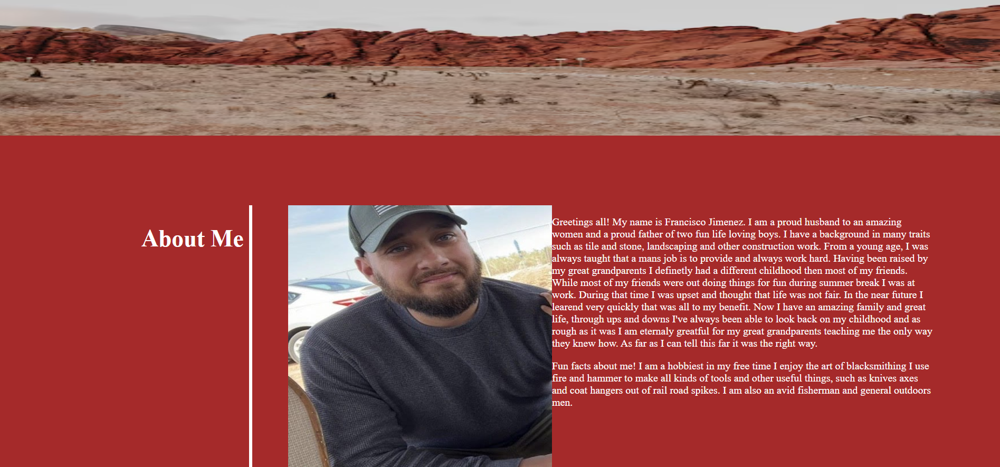

# My-portfolio
My-Portfolio

This is a landing page that i have created about me, the work I have done so far in the corse and different contact information.

I used many different options to creat the landing page provided such as different margins and styling options I thought would represent me. Including an about me secton where I shared just a few things about myself that makes me, me.


I did take advantage of many differnt resorces while completing this task.
The number one resorce I did take advantage of was chatGPT 
but I also used others such as,MDN,Google and css tricks 

Please note that i had this work saved in the wrong file, therfore my commits will be low. (My mistake)


 (screen shot of my landing page) 

```


## Credits

I would like to give credit to the tutors I worked with from the school. They really helped me in understanding the 
steps it took to make this web page.


